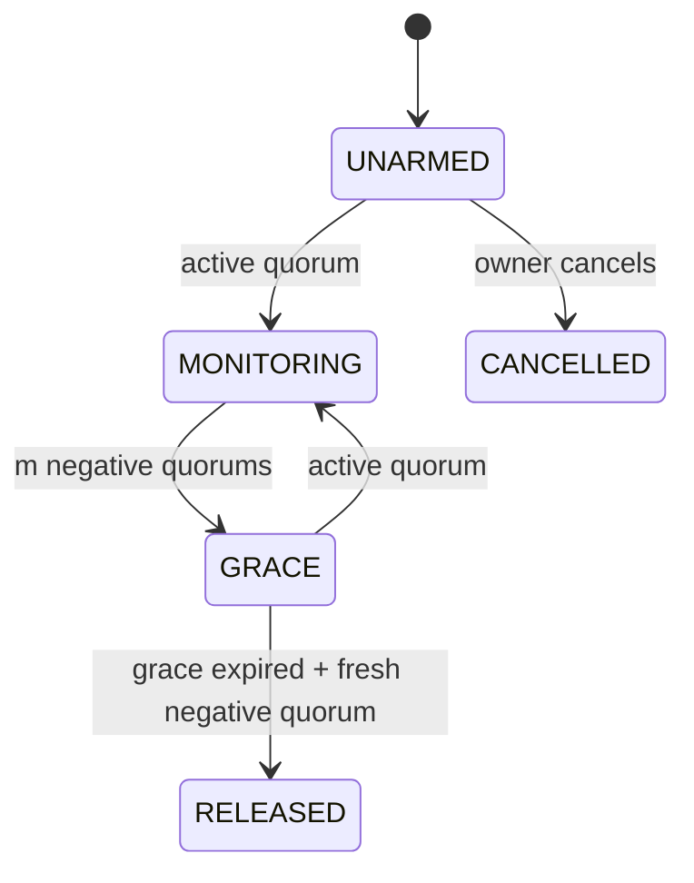

# Open-World Liveness Switch

A reusable GenLayer Intelligent Contract that turns heterogeneous public evidence into a fail-safe release authorization.

Traditional dead man's switches treat a signature as proof of life. This primitive instead asks validators to inspect owner-selected public sources and agree whether those sources contain recent qualifying activity. It deliberately does **not** claim to prove death. Its only semantic outcomes are:

- `CONFIRMED_ACTIVE` — enough positive evidence satisfies the registered criteria;
- `CONFIRMED_NO_ACTIVITY` — enough complete, identity-matched sources show no qualifying activity;
- `INCONCLUSIVE` — outages, partial pages, ambiguity, identity mismatch, or an insufficient quorum.

`UNKNOWN` never counts as inactivity and never lowers a quorum.

## Why this is an Intelligent Contract

A normal smart contract cannot open GitHub, a blog, and an owner-controlled status page, interpret different kinds of dated evidence, distinguish an outage from inactivity, or reach consensus when page rendering and LLM wording vary. GenLayer validators can independently fetch those sources and apply an explicit equivalence rule to the safety-relevant labels.

The contract uses a custom `run_nondet_unsafe` validator. Validators repeat the fetch and classification, require exact agreement on each source's `status`, `coverage`, and `anchor_status`, then semantically compare the supporting evidence. State changes only after that result is accepted.

## Safety model

- 3–8 sources and at least two source families are mandatory.
- Positive evidence is asymmetric: an active quorum overrides negative evidence.
- Negative progression requires both a source-count quorum and a family-diversity quorum.
- `NO_ACTIVITY` requires complete coverage, a matching identity anchor, and confidence ≥80.
- At least two consecutive negative probes are mandatory.
- A switch cannot arm from absence. Its first state transition requires positive consensus.
- Grace is mandatory and can be extended once by the owner or any guardian.
- Expiry alone cannot release. A fresh negative consensus probe after grace is mandatory.
- Configuration becomes immutable after arming; a stolen owner key cannot cancel an armed switch.
- No actor can accelerate release.



## What is released

The primitive stores beneficiary shares, a payload URI, and a SHA-256 commitment. `authorization()` exposes the payload metadata only in `RELEASED`. A downstream escrow, DAO, multisig adapter, or access-control contract can consume `liveness()` or `authorization()`.

On-chain storage is public. Do not put plaintext secrets or decryption keys in `payload_uri`. Store encrypted content externally and treat this contract as release authorization, not confidential key custody.

## Core API

- `register_switch(...)` — validate and freeze sources, thresholds, beneficiaries, guardians, and payload commitment.
- `probe(switch_id)` — public consensus probe and state transition.
- `request_grace_extension(switch_id)` — one aggregate extension by owner or guardian.
- `cancel_unarmed(switch_id)` — owner cancellation before positive arming only.
- `liveness(switch_id)` — compact composable state.
- `authorization(switch_id, beneficiary)` — released beneficiary share and payload metadata.
- `get_switch`, `get_source`, `get_probe`, `get_stats` — audit views.

See [API](docs/API.md), [consensus design](docs/CONSENSUS.md), and [security model](docs/SECURITY.md).

## Example configuration

[`examples/alice_switch.json`](examples/alice_switch.json) contains three source families, two beneficiaries, a guardian, and conservative thresholds. Natural-language criteria must describe evidence that the rendered source can completely evaluate. A paginated or login-gated activity feed should produce `UNKNOWN`, not `NO_ACTIVITY`.

## Verification

Requirements: Python 3.12+, `uv`, and the pinned packages in `requirements-dev.txt`.

```bash
./scripts/verify.sh
```

The verification script performs two independent passes of syntax compilation, GenVM lint/SDK validation, GenVM type checking, and all 21 direct-mode tests. See [VERIFICATION.md](VERIFICATION.md).

## Bradbury deployment

- Contract: `0x66553A47Cf2ad63671E3f8003ADD7a46790aB7B9`
- Transaction: `https://explorer-bradbury.genlayer.com/tx/0xb9fc529cf68e604b83df354f79e94c1466478dae86aa9d020b9570f3b50bbddb`
- Source SHA-256: `9308a95b5cec8d20f215580342ae0290473c3ec908654737d7faec2da4349036`

## Honest limitations

- Public activity is not biological or legal proof of life or death.
- Compromised public accounts can forge activity; use heterogeneous sources and guardians.
- A website can change structure or hide history. That must fail safe as `UNKNOWN`.
- A colluding validator majority can still accept a wrong semantic result; GenLayer's appeal/finality model remains relevant.
- This contract authorizes release but does not provide confidential storage, native-token custody, legal probate, identity recovery, or source availability.
- Criteria that cannot prove complete coverage should never yield `NO_ACTIVITY`.

## License

MIT
